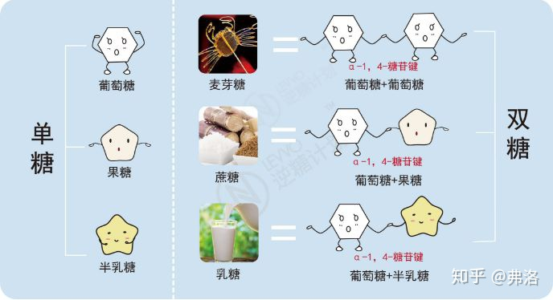

[Home](../README.md)

# common-sense(常识)
❤ 这里记录一些生活上的常识，愿你保持好奇心 ❤

// TODO: 缺个目录？

## 目录
- [1.饭后可以立即吃水果吗？](#1.饭后可以立即吃水果吗？)
- [2.加油站是否可以用手机接打电话？](#2.加油站是否可以用手机接打电话？)
- [3.香蕉外皮上的黑色斑点是怎么回事？](#3.香蕉外皮上的黑色斑点是怎么回事？)
- [4.什么是"膳食纤维"？](#4.什么是"膳食纤维"？)

## 1.饭后可以立即吃水果吗？
不建议。

水果中含有大量的`单糖类物质`，很容易被小肠所吸收，但若被饭菜堵在胃中，就会因腐败而成胀气、使胃部不适，所以，吃水果应在饭前1小时或饭后2小时为宜。

### 1.0 人体代谢过程
进入口腔 -> 食道 -> 胃 -> 小肠 -> 大肠 -> 排出体外

### 1.1 单糖
糖主要分为单糖、多糖。

糖由简单的碳水化合物——单糖构成，一般的化学式为(n>=3):  **(CH2O)n**

单糖是指分子结构中含有3~6个碳原子的糖。单糖是糖类的最小单位，因为它无法在进行水解。

属于单糖的有：  
6碳糖：葡萄糖（C6H12O6）、己糖、果糖、半乳糖；  
5碳糖：核糖、木糖；

葡萄糖：  
溶解度：83g/100ml  
密度：1.54kg/m3

果糖（葡萄糖的`同分异构体`）：  
以游离状态大量存在于`水果`的浆汁和`蜂蜜`中。  
是自然界最甜的单糖。
相比于葡萄糖对血糖的提升程度来看，葡萄糖是100的话，果糖就是25左右。  
溶解度：375g/100ml  
密度：1.75kg/m3
分解果糖的`果糖激酶`只在`肝`内表达。
> 总之，果糖代谢过程中`限速酶`的缺失使得果糖能较为快速且无节制地最终转化为肝脏脂肪。  
> 这是由于果糖不像葡萄糖那样可以做到"按需所取"、受胰岛素控制，可以减缓代谢。

半乳糖：  
存在奶类产品或甜菜中。  
是在肠道内吸收最快的单糖。  
乳糖在乳糖酶的作用下被水解为葡萄糖和半乳糖。

### 1.2 多糖
可水解为多个单糖分子的糖为`多糖`。

乳糖（C12H22O11）：  
乳糖是人类和哺乳动物乳汁中特有的碳水化合物，是由`葡萄糖`和`半乳糖`组成的`双糖`。  
乳糖在胃中不易被吸收，而是到达肠道后被`乳糖酶`分解成`葡萄糖`和`半乳糖`。  
溶解度：216g/100ml  

蔗糖：  
蔗糖的一半是`葡萄糖`，另一半就是`果糖`。

麦芽糖：  
由2个葡萄糖分子构成。  

## 2.加油站是否可以用手机接打电话？

## 3.香蕉外皮上的黑色斑点是怎么回事？
植物炭疽病，或者是因香蕉皮细胞膜内的化学物质暴露在氧气中被氧化为黑色。

炭疽病是植物类的，和人类的无关。

香蕉稍微磕碰就会变黑，也是因为细胞膜破裂导致被氧化。

**香蕉不宜放入冰箱**，因为受冻也会导致细胞膜破裂，抗氧化物质失去活性，从而又被氧化？

## 4.什么是"膳食纤维"？
香蕉通便，正是因为香蕉`膳食纤维`含量高，多吃一些香蕉可以帮助身体促进肠胃蠕动。

### 4.1 膳食纤维
膳食纤维是一种`多糖`，它既不能被胃肠道消化吸收，也不能产生能量。因此，曾一度被认为是一种“无营养物质”。

人体六大营养元素：碳水化合物、脂肪、蛋白质、维生素、矿物质和水。

膳食纤维号称是第七类营养元素。

膳食纤维在水中的溶解性可以划分为**可溶性纤维**和**不可溶性纤维**两大类。

### 4.2 可溶性纤维
水果中的果胶、魔芋中的葡甘聚糖（主要成分，其能量很低，吸水性强）。

魔芋有降血脂和降血糖的作用及良好的通便作用。

功能：
- 降低胆固醇
- 降低餐后血糖的上升

### 4.3 不可溶性纤维
主要存在于谷物的表皮，全谷类粮食如麦麸、麦片、全麦粉及糙米、燕麦、荞麦、莜麦、玉米面等，以及水果的皮核、蔬菜的茎叶、豆类及豆制品等。

功能：
- 增加饱腹感
- 促进肠道蠕动

不可溶性纤维在肠胃吸收肠道菌落、废物等，吸水膨胀增大便便体积促进排便冲动？？不是不溶于水么？

### 4.4 富含膳食纤维的食物
山楂干：50%+
一个梨：5g
樱桃：膳食纤维（0.3g/100g），铁（0.4mg/100g）？？数据没有标准的！

<!-- dietary fiber -->

## 5. 玫瑰花为什么一周就凋谢了？

先上结论：

如何延长花开时间？
最简单最懒的办法就是一天换一次水~换水后将枝条剪掉一小截。
买回家后先剪玫瑰根在放到水里,此后每天剪根换水,最好是自来水,水可以放多一点20-30公分左右,剪根时最好是斜剪,这样接触水的面积最大。

### 5.1 玫瑰
一年一次，花期5-6月，果期8-9月。
15度到25度之间，它喜欢生长在光线充足且干燥的地方。

### 5.2 

## 6. 蓝莓和牛奶可以一起吃吗？

***不可以。***

维生素C与牛奶不可同食。（需间隔1h）  
草酸与钙不可同食。

而蓝莓是水果中维C和草酸都最多的。

因此，蓝莓不可与以下同食：

1. 乳制品
2. 高钙

### 6.1 原因

对于乳制品：
蓝莓富含大量维生素C（是苹果的几十倍），牛奶富含蛋白质，维生素C会与牛奶中的蛋白质相遇，使蛋白质变性而凝固成块，影响消化吸收，而且还会使人发生腹胀、腹痛、腹泻等症状。

对于高钙类：
蓝莓富含草酸，与钙离子结合成草酸钙沉淀，不利于排出体外而形成结石。

蓝莓营养成分表（每100g）
能量： 205kJ  
碳水化合物：12.9g  
蛋白质：0.5g  
脂肪：0g  
钠：1mg  

### 6.2 蓝莓+牛奶腹痛了怎么办？

1.喝热水，促进代谢  
2.按摩腹部，促进蠕动  
3.拉屎  

蓝莓一天可以吃10~20颗，与牛奶同食时5颗以内少吃点没啥事，你是不是吃多了！

### 6.3 引申

蓝莓、黑莓、猕猴桃，草酸稍多；

## 7. 为什么会脱发？

雄性激素源性脱发，也称为"脂溢性脱发"。头皮脂肪过量溢出，常伴有头屑增多，头皮油腻，瘙痒明显。

## 8. 蛋白质吃多了会怎样？

增加肾脏负担。

因为多余的产物排不出去容易堆积造成上述后果。

背景：

2021.09.05周日，出差前的一天，和笑去盒马买了2只螃蟹20元，三十多只大基围虾41元，吃了挺多蛋白质但是笑说感觉没吃饱，想喝旺仔牛奶吃点毛豆，可以吗？

在胃里面，胃蛋白酶初步分解蛋白质成多肽；

在小肠里面，胰腺分泌的胰蛋白酶，和小肠分泌的氨基肽酶，二肽酶等,以多种方式分步地将多肽链水解为氨基酸；

氨基酸透过小肠绒毛上皮进入血液，被人体吸收。
